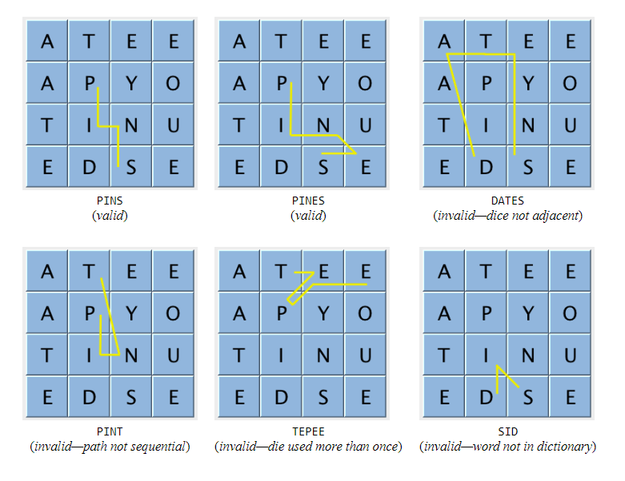
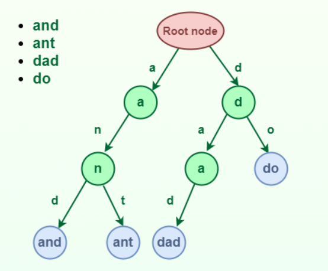
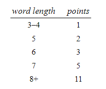

# Boggle

This project is a speed-optimized Java program designed to solve Boggle boards, prioritizing fast execution over memory efficiency.

Boggle is a word game. It involves a board made up of 16 cubic dice, where each die has a letter printed on each of its 6 sides. At the beginning of the game, the 16 dice are shaken and randomly distributed into a 4-by-4 tray, with only the top sides of the dice visible. The players compete to accumulate points by building valid words from the dice, according to these rules:

* A valid word must be composed by following a sequence of adjacent dice—two dice are adjacent if they are horizontal, vertical, or diagonal neighbors.

* A valid word can use each die at most once.

* A valid word must contain at least 3 letters.

* A valid word must be in the dictionary (which typically does not contain proper nouns).

Here are some examples of valid and invalid words:

 

## Implementation

Checking the words in the dictionary while researching the words on the Boggle board is the most crucial part of the problem. Therefore, the key focus of this project lies in employing a data structure that efficiently supports string search. I have chosen to use the trie data structure for its ability to provide the fastest string search.

### Trie data structure

A trie is a multiway tree data structure used for storing strings over an alphabet. It is used to store a large amount of strings. The pattern matching can be done efficiently using tries. Preprocessing pattern improves the performance of pattern matching algorithm.

The idea is that all strings sharing common prefix should come from a common node.

 

## Scoring

Valid words are scored according to their length, using this table:

 

## The Qu special case

 In the English language, the letter Q is almost always followed by the letter U. Consequently, the side of one die is printed with the two-letter sequence Qu instead of Q And this two-letter sequence being used together when forming words. When scoring, Qu counts as two letters; for example, the word QuEUE scores as a 5-letter word even though it is formed by following a sequence of only 4 dice.
 
 
 
## Performance

This program can preprocess the dictionary to identify all valid words on a randomly generated Boggle board in a fraction of a second. The primary objective of this project is to achieve raw speed, and the code is designed under the assumption that there are no memory limitations. It is capable of solving thousands of random Boggle boards per second. 

 
 

Mustafa Turgut   
mstftrgt00@gmail.com

